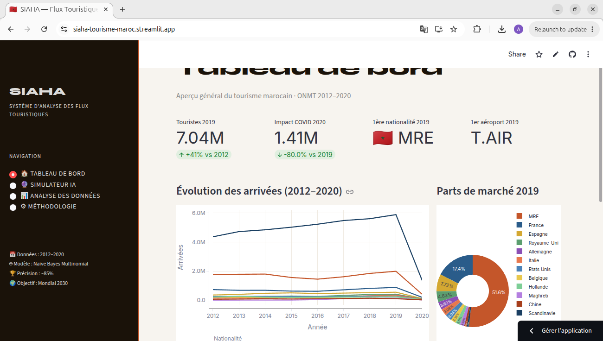
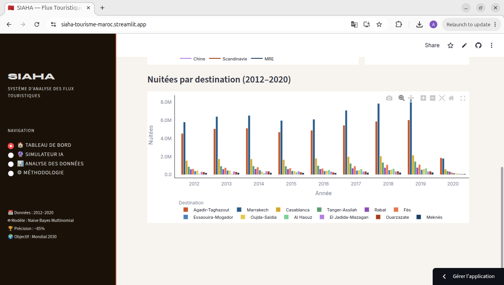
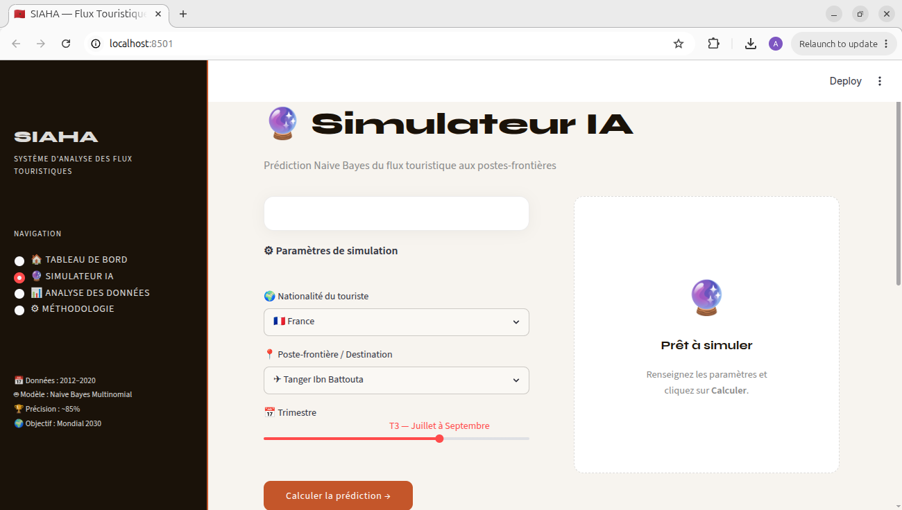
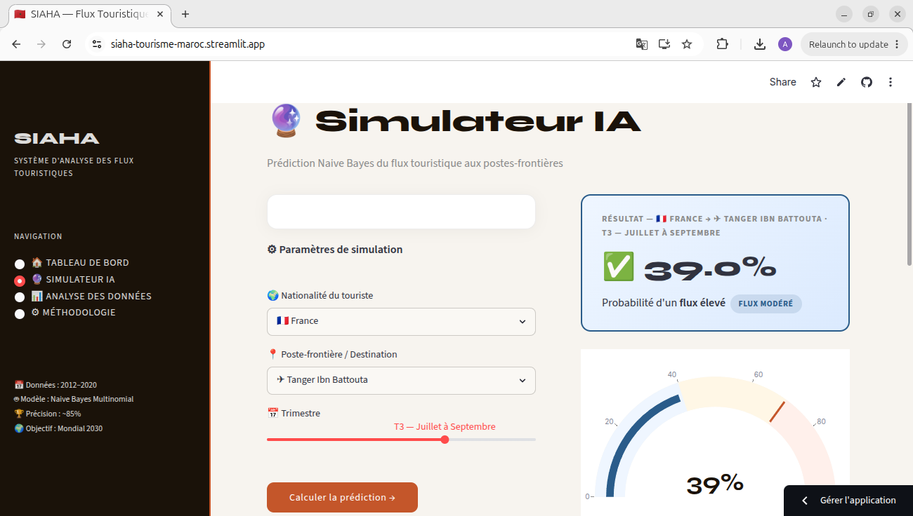
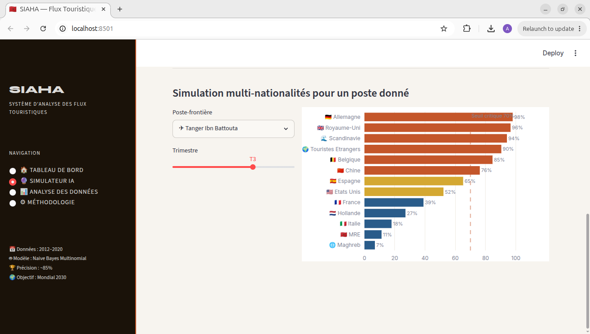

<div align="center">

# 🇲🇦 SIAHA
### Système Intelligent d'Analyse des Flux Touristiques au Maroc

**Outil d'aide à la décision** basé sur la classification Bayésienne pour anticiper les pics de flux touristiques aux postes-frontières du Maroc — développé dans le cadre de la préparation stratégique au **au Coupe du Monde FIFA 2030** 

**voir le site:** 
### 🔗 [https://siaha-tourisme-maroc.streamlit.app](https://siaha-tourisme-maroc.streamlit.app)

</div>

---

##  Aperçu de l'application

###  1. Tableau de bord — Vue d'ensemble



> Le tableau de bord affiche les **indicateurs clés** du tourisme marocain :
> - **7.04M** touristes en 2019 (+41% vs 2012)
> - **1.41M** en 2020 (-80% : impact COVID-19)
> - La **1ère nationalité** : MRE (Marocains Résidant à l'Étranger)
> - Le **1er aéroport** : Mohammed V (Casablanca)
>
> Les graphiques interactifs montrent l'évolution des arrivées par nationalité (2012–2020) et les parts de marché en 2019.

---

### 2. Analyse des nuitées par destination



> Visualisation des **nuitées réalisées** dans les établissements touristiques marocains par destination (2012–2020) :
> - **Marrakech** et **Agadir-Taghazout** dominent le marché
> - La chute brutale en 2020 reflète l'arrêt total du tourisme dû au COVID-19
> - Graphique en barres groupées avec légende complète par ville

---

###  3. Simulateur IA — Paramètres



> L'interface du simulateur permet de configurer **3 paramètres** :
> -  **Nationalité** du touriste (13 nationalités disponibles)
> -  **Poste-frontière** de destination (aéroports, ports, postes terrestres)
> -  **Trimestre** (T1 à T4, avec slider interactif)
>
> Le modèle **Naive Bayes Multinomial** calcule la probabilité de flux élevé en temps réel.

---

###  4. Résultat de la prédiction



> Exemple de résultat : **Espagne → Tanger Ibn Battouta, T3** :
> - **P(Flux Élevé) = 65.2%** → Badge "FLUX ÉLEVÉ"
> - **Jauge visuelle** Plotly en temps réel
> - **Message d'alerte** : *"Vigilance conseillée — Flux intermédiaire"*
> - Recommandation opérationnelle automatique selon le seuil de 70%

---

###  5. Simulation multi-nationalités



> Vue comparative de **toutes les nationalités** pour un poste donné (Tanger Ibn Battouta, T3) :
> - 🔴 **Rouge** : flux critique (> 70%) — Allemagne 98%, Royaume-Uni 96%
> - 🟡 **Or** : flux intermédiaire (50–70%) — Espagne 65%, États-Unis 52%
> - 🔵 **Bleu** : flux maîtrisable (< 50%) — France 39%, MRE 11%
>
> La **ligne pointillée rouge** marque le seuil critique à 70%.

---

##  Contexte du projet

## 🌍 Contexte

Ce projet a été développé dans le cadre du module **"Analyse des données et classification"** lors de ma première année de Master en **Intelligence Artificielle et Objets Connectés (IAOC)** à la Faculté des Sciences-Université Ibn Tofaïl. 

Il se base sur un cas d'usage réel : la **préparation stratégique au Coupe du Monde FIFA 2030** coorganisé par le Maroc, l'Espagne et le Portugal. L'objectif académique et pratique est de fournir aux décideurs un outil d'aide à la décision basé sur l'apprentissage automatique pour anticiper les pics de flux touristiques aux postes-frontières.

SIAHA fournit aux décideurs un outil ML pour :

- Anticiper les **pics de congestion** aux postes-frontières
- Identifier les **nationalités à fort flux** par destination et par saison
- Planifier les **ressources humaines et infrastructurelles** en amont des grands événements

---

##  Méthodologie

### Pipeline de Machine Learning

```
Données ONMT  ──►  Fusion      ──►  Feature Eng.     ──►  Naive Bayes  ──►  Évaluation  ──►  Streamlit
  (3 fichiers        pandas          LabelEncoder           MultNB           ~85%              Cloud
   Excel)                          + Interaction          (sklearn)        accuracy
                                     Nat × Prov
```

### Théorème de Bayes appliqué

Le modèle estime pour chaque combinaison (Nationalité, Province, Trimestre) :

```
P(Flux Élevé | features) = P(features | Élevé) × P(Élevé)
                           ─────────────────────────────────
                                   P(features)
```

Avec l'hypothèse d'indépendance conditionnelle (Naive) :

```
P(x1, x2, x3, x4 | C) = P(x1|C) × P(x2|C) × P(x3|C) × P(x4|C)
```

### Variables du modèle

| Variable | Type | Description |
|----------|------|-------------|
| `nat_encoded` | Feature | Nationalité du touriste (LabelEncoder) |
| `prov_encoded` | Feature | Poste-frontière / province (LabelEncoder) |
| `trim_encoded` | Feature | Trimestre 1–4 (saisonnalité) |
| `inter_encoded` | Feature | Interaction Nationalité × Province |
| `target_flux` | **Cible Y** | 1 si flux > médiane historique, 0 sinon |

### Métriques de performance

| Métrique | Valeur |
|----------|--------|
|  Accuracy globale | **~85%** |
|  Split Train/Test | 80% / 20% |
|  Algorithme | MultinomialNB |
|  Nombre de features | 4 |

---

##  Données utilisées

| Attribut | Détail |
|----------|--------|
| **Source** | Office National Marocain du Tourisme (ONMT) |
| **Période** | 2012 – 2020 (9 années) |
| **Nationalités** | 13 (France, Espagne, MRE, Maghreb, Royaume-Uni, Allemagne, Italie, États-Unis, Belgique, Hollande, Chine, Scandinavie, Total) |
| **Postes-frontières** | 19 (11 aéroports, 3 ports, 2 postes terrestres, 3 totaux) |
| **Destinations (nuitées)** | 11 villes (Marrakech, Agadir, Casablanca, Fès, Tanger…) |

---

##  Structure du projet

```
siaha/
│
├──  app.py                                           # Application Streamlit (4 pages)
├──  requirements.txt                                 # Dépendances Python
├──  README.md                                        # Ce fichier
│
├── 📓 Tourisme_Classification_Bayes_Bayes.ipynb        # Notebook ML complet
│
├──  Données source (ONMT)
│   ├── evolution-par-nationalite-...-frontieres.xlsx
│   ├── evolution-par-point-dentree-...-frontieres.xlsx
│   └── evolution-nuitees-...-par-destination.xlsx
│
└──  Modèle sérialisé (joblib)
    ├── model_naivebayes.pkl    # Modèle Naive Bayes Multinomial
    ├── le_nat.pkl              # Encodeur nationalités
    ├── le_prov.pkl             # Encodeur provinces/postes
    ├── le_trim.pkl             # Encodeur trimestres
    └── le_inter.pkl            # Encodeur interaction nat × province
```

---

##  Lancer en local

```bash
# 1. Cloner le projet
git clone https://github.com/VOTRE-USERNAME/siaha-tourisme-maroc.git
cd siaha-tourisme-maroc

# 2. Installer les dépendances
pip install -r requirements.txt

# 3. Lancer l'application
streamlit run app.py
# → http://localhost:8501
```

---

##  Utiliser le modèle en Python

```python
import joblib, pandas as pd

model    = joblib.load('model_naivebayes.pkl')
le_nat   = joblib.load('le_nat.pkl')
le_prov  = joblib.load('le_prov.pkl')
le_trim  = joblib.load('le_trim.pkl')
le_inter = joblib.load('le_inter.pkl')

# Prédire : Espagne → Tanger Ibn Battouta, T3
nat_idx   = le_nat.transform(['Espagne'])[0]
prov_idx  = le_prov.transform(['A Tanger Ibn Battouta'])[0]
trim_idx  = le_trim.transform([3])[0]
inter_idx = le_inter.transform([f'{nat_idx}_{prov_idx}'])[0]

proba = model.predict_proba(
    pd.DataFrame([[nat_idx, prov_idx, trim_idx, inter_idx]],
                 columns=['nat_encoded','prov_encoded','trim_encoded','inter_encoded'])
)[0]

print(f"P(Flux Élevé) = {proba[1]*100:.1f}%")
# → P(Flux Élevé) = 65.2%
```

---

##  Scénarios Mondial 2030

| Scénario | Poste | Nationalité | Trimestre | P(Élevé) | Action recommandée |
|----------|-------|-------------|-----------|-----------|-------------------|
| 🔴 Critique | Mohammed V | Touristes Étrangers | T3 | > 80% | Renforcement urgent |
| 🟠 Vigilance | Tanger Ibn Battouta | Espagne | T3 | ~65% | Renforts ponctuels |
| 🟡 Modéré | Tanger Med | MRE | T2 | ~55% | Surveillance renforcée |
| 🟢 Normal | Ouarzazate | Allemagne | T1 | < 40% | Surveillance standard |

---

##  Stack technique

| Technologie | Rôle |
|-------------|------|
| **Python 3.10+** | Langage principal |
| **Streamlit** | Interface web interactive multi-pages |
| **scikit-learn** | Modèle Naive Bayes Multinomial |
| **Plotly** | Graphiques interactifs (lignes, barres, jauge, heatmap) |
| **Pandas / NumPy** | Traitement et analyse des données |
| **joblib** | Sérialisation du modèle (.pkl) |
| **openpyxl** | Lecture des fichiers Excel ONMT |
| **Streamlit Cloud** | Hébergement et déploiement gratuit |

---

##  Licence

Usage académique et éducatif — Données ONMT (Office National Marocain du Tourisme).

---


